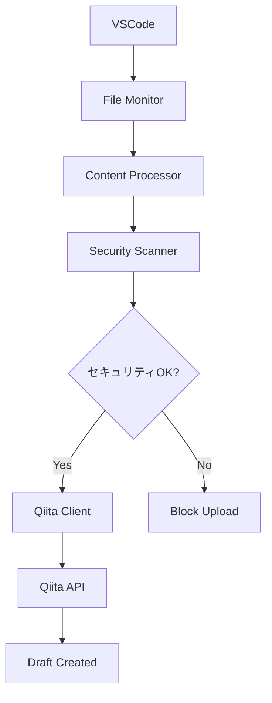

# VSCodeで作業した内容を自動でQiitaの下書きに保存するシステム「AutoQiita」を作成しました

## はじめに

VSCodeで作業しているとき、「この知見をQiitaに残したいな」と思うことがよくあります。しかし、いちいち手動でコピペして記事を作成するのは面倒です。

そこで、**VSCodeでファイルを編集すると自動でQiitaの下書きに保存される**システム「AutoQiita」を作成しました。

## システム概要

AutoQiitaは以下の技術を組み合わせたシステムです：

- **Python** + **uv**: 高速パッケージ管理
- **FastAPI**: MCPサーバー
- **watchdog**: ファイル監視
- **Qiita API**: 下書き自動保存
- **VSCode拡張機能**: ユーザーインターフェース

## 主な機能

### 🔄 自動監視・保存
- VSCodeでのファイル変更を検知
- デバウンス機能で頻繁な保存を防止
- 複数のファイル形式に対応（Python、JavaScript、Markdown等）

### 🛡️ セキュリティチェック
- APIキー、パスワードなどの機密情報を自動検出
- 危険なコードパターンの検出
- 重大な問題がある場合は自動でアップロードをブロック

### 📂 柔軟な拡張子管理
- インタラクティブな監視対象拡張子の追加
- キーワードベースの拡張子提案（react → .jsx, .tsx）
- プロジェクトに応じたカスタマイズ

### 🏢 複数ワークスペース対応
- 複数のプロジェクトを同時監視
- ワークスペースごとの個別設定

## アーキテクチャ



## セキュリティ機能の詳細

### 検出項目

#### 🔑 認証情報
- パスワード、APIキー、アクセストークン
- 秘密鍵（RSA等）
- データベース接続文字列
- AWS、GitHub等のサービス固有トークン

#### 👤 個人情報
- メールアドレス
- IPアドレス（パブリック）
- 電話番号

#### ⚠️ 危険なコード
- `eval`/`exec`の使用
- シェルインジェクションの可能性
- `pickle.loads`の危険な使用
- 破壊的システムコマンド

#### 🌐 Webセキュリティ
- XSS攻撃パターン
- SQLインジェクション攻撃パターン

### セキュリティレベル

- **Critical**: 自動ブロック（強制オプションあり）
- **High**: 警告表示、確認プロンプト
- **Medium**: 注意喚起
- **Low**: 情報提示

### セキュリティ警告の自動追加

問題が検出された場合、記事の先頭に自動で警告セクションを追加：

```markdown
🚨 **セキュリティ重要**

この記事には以下のセキュリティに関する項目が含まれています：

- 認証情報: 2件
- 危険なコード: 1件

記事の内容を確認し、必要に応じて以下の対応を行ってください：
- 実際の認証情報やAPIキーが含まれていないか確認
- 個人情報（メールアドレス、電話番号等）の匿名化
- 危険なコード例には適切な警告を追加
```

## 拡張子管理機能

### インタラクティブ追加

```bash
uv run autoqiita extensions add
```

実行すると：

```
🔍 監視対象ファイルを追加します
現在の監視対象:
  .py - Python files
  .js - JavaScript files
  .md - Markdown files
  ...

💡 キーワード例: react, vue, python, web, config, etc.

追加したい拡張子またはキーワードを入力してください (終了: quit): react

'react' に関連する拡張子:
  1. [ ] .jsx - JavaScript React files
  2. [ ] .tsx - TypeScript React files
  a. すべて追加
  s. スキップ

選択してください: a
✅ 追加しました: .jsx, .tsx
```

### キーワードマッピング

| キーワード | 対応拡張子 |
|-----------|-----------|
| react | .jsx, .tsx |
| vue | .vue |
| angular | .ts, .html, .scss |
| python | .py |
| web | .html, .css, .js |
| config | .json, .yaml, .yml, .toml, .ini |

## セットアップ手順

### 1. 環境準備

```bash
# uvのインストール（未インストールの場合）
curl -LsSf https://astral.sh/uv/install.sh | sh

# プロジェクトクローン
git clone <repository-url>
cd AutoQiita

# 自動セットアップ
./setup.sh
```

### 2. 環境設定

```bash
# .envファイル編集
nano .env

# Qiita APIトークンを設定
QIITA_ACCESS_TOKEN=your_token_here
```

### 3. システム起動

```bash
# MCPサーバー起動
uv run autoqiita server

# または監視モード
uv run autoqiita monitor /path/to/project
```

## 使用例

### 基本的な使用

```bash
# ワークスペース追加
uv run autoqiita workspace add /path/to/project --name "MyApp"

# 手動保存（セキュリティチェック付き）
uv run autoqiita save example.py

# セキュリティスキャンのみ
uv run autoqiita security scan example.py
```

### セキュリティオプション

```bash
# セキュリティ問題があっても強制保存
uv run autoqiita save example.py --force

# セキュリティチェック無効
uv run autoqiita save example.py --no-security-check
```

### 拡張子管理

```bash
# 現在の監視対象確認
uv run autoqiita extensions list

# React関連拡張子を提案
uv run autoqiita extensions suggest react

# Go言語ファイルを追加
uv run autoqiita extensions add .go
```

## プロジェクト構成

```
AutoQiita/
├── autoqiita/
│   ├── __init__.py
│   ├── cli.py                    # CLIインターフェース
│   ├── config.py                 # 設定管理
│   ├── content_processor.py      # コンテンツ処理
│   ├── extension_manager.py      # 拡張子管理
│   ├── file_monitor.py          # ファイル監視
│   ├── mcp_server.py            # MCPサーバー
│   ├── multi_workspace.py       # 複数ワークスペース管理
│   ├── qiita_client.py          # Qiita API クライアント
│   └── security_scanner.py      # セキュリティスキャナー
├── config/
│   ├── security_rules.json      # セキュリティルール
│   ├── settings.json            # システム設定
│   └── watched_extensions.json  # 監視対象拡張子
├── vscode_extension/            # VSCode拡張機能
├── setup.sh                    # セットアップスクリプト
├── end.sh                      # 終了スクリプト
├── Makefile                    # 開発用コマンド
└── pyproject.toml              # 依存関係設定
```

## 技術的な工夫

### 1. uvによる高速環境管理

従来の`pip`から`uv`に移行し、パッケージインストールを高速化：

```toml
[dependency-groups]
dev = [
    "pytest>=7.4.0",
    "black>=23.0.0",
    "mypy>=1.5.0"
]
```

### 2. デバウンス機能

頻繁なファイル変更時の重複保存を防止：

```python
class VSCodeFileHandler(FileSystemEventHandler):
    def __init__(self):
        self.last_modified = {}
        self.debounce_time = 2.0  # 2秒のデバウンス
    
    def on_modified(self, event):
        current_time = time.time()
        if file_path in self.last_modified:
            if current_time - self.last_modified[file_path] < self.debounce_time:
                return  # デバウンス中はスキップ
```

### 3. 段階的セキュリティチェック

正規表現パターンマッチングによる多層防御：

```python
patterns = {
    "credentials": [
        {
            "pattern": r"(?i)(api[_-]?key|access[_-]?token)\s*[=:]\s*[a-zA-Z0-9_-]{16,}",
            "level": "critical",
            "description": "APIキーが含まれている可能性があります"
        }
    ]
}
```

### 4. 設定の永続化

JSON形式での設定管理により、システム再起動後も設定を保持：

```json
{
  "extensions": [".py", ".js", ".tsx"],
  "descriptions": {
    ".tsx": "TypeScript React files"
  }
}
```

## パフォーマンス

### ファイル監視
- **watchdog**ライブラリによる効率的なファイルシステム監視
- デバウンス機能により不要な処理を削減

### セキュリティスキャン
- 正規表現の事前コンパイル
- ホワイトリスト機能による除外処理
- 段階的チェックによる早期終了

### API呼び出し
- 既存下書きの検索・更新機能
- エラーハンドリングとリトライ機能

## 今後の拡張予定

### 1. AI機能
- GPTによる記事内容の自動改善提案
- タグの自動生成
- セキュリティ問題の自動修正提案

### 2. 他プラットフォーム対応
- Zenn
- note
- はてなブログ

### 3. チーム機能
- 複数人での共有設定
- レビュー機能
- 承認フロー

## まとめ

「AutoQiita」により、以下が実現できました：

✅ **自動化**: VSCodeでの作業内容を自動でQiitaに保存
✅ **セキュリティ**: 機密情報の漏洩を防止
✅ **柔軟性**: プロジェクトに応じた拡張子管理
✅ **効率性**: uvによる高速環境構築
✅ **保守性**: モジュラー設計による拡張性

開発者の知識共有を促進し、セキュリティを担保しながら効率的な記事作成を支援するシステムとなりました。

## リポジトリ

GitHub: [AutoQiita](https://github.com/your-username/AutoQiita)

## 関連タグ

#Python #VSCode #Qiita #自動化 #セキュリティ #MCP #FastAPI #uv